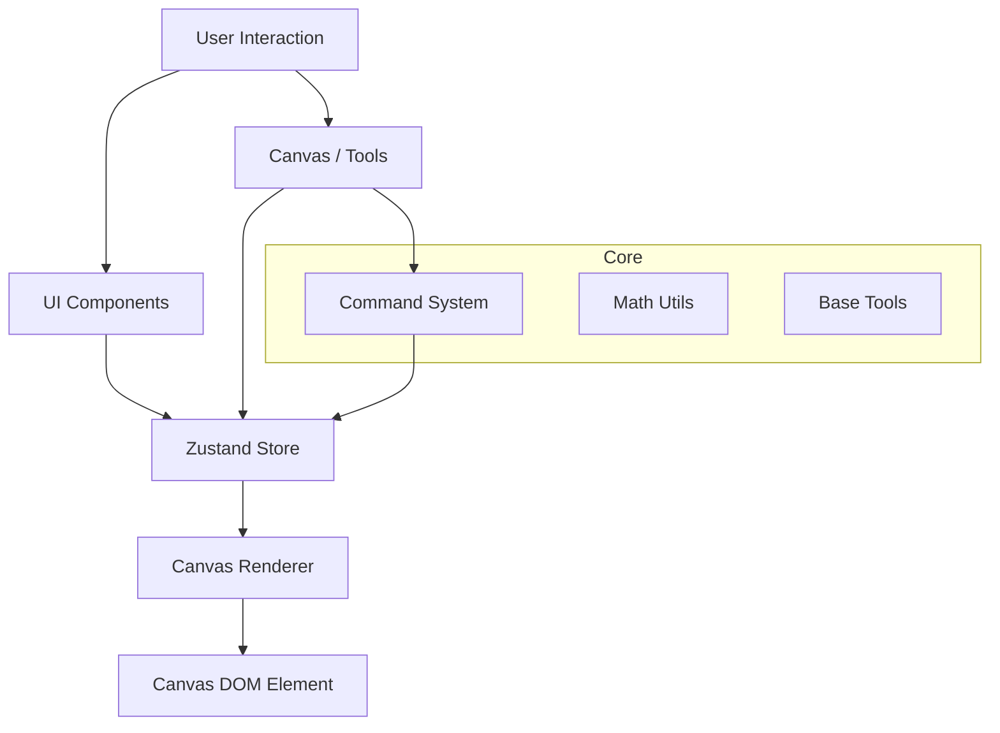

# LaserReady Architecture

> **Version**: 0.1
> **Last Updated**: 2024-12-24

## Overview

LaserReady is a browser-based vector graphics editor optimized for laser cutting workflows. The application is built with React, TypeScript, and Zustand for state management, following a feature-based architecture with clear separation of concerns.

## Architecture Principles

### 1. Feature-Based Organization
Code is organized by features (shapes, editor, ui) rather than by technical layers, promoting modularity and maintainability.

### 2. Separation of Concerns
- **Core**: Reusable, low-level utilities (math, commands, tools)
- **Features**: Self-contained modules with their own models, tools, and UI
- **Shared**: Cross-cutting UI components
- **Config**: Application-wide configuration

### 3. Unidirectional Data Flow
State flows from Zustand store → Components → User actions → Store updates

### 4. Type Safety
Comprehensive TypeScript usage with interfaces and type definitions in dedicated `types/` directories.

## System Architecture



## Directory Structure

```text
src/
├── config/              # Global configuration (constants, theme)
├── core/                # Core logic (Math, Base Commands, Base Tools)
├── features/            # Feature modules
│   ├── editor/          # Canvas logic, History, Input management
│   ├── shapes/          # Shape specific logic (Path, Rect, Text)
│   └── ui/              # Main UI layout (Toolbar, Panels)
├── shared/              # Reusable UI components
├── store/               # State management (Zustand slices)
├── types/               # Global TypeScript definitions
└── utils/               # IO, Export/Import, Helpers
```

## Core Technical Concepts

### 1. Coordinate Systems
The application handles two distinct coordinate spaces:
- **Screen Space**: Pixels relative to the browser viewport (used for Pointer Events).
- **World Space**: The logical units (mm) inside the infinite canvas.
- **Transformation**: The `renderer.ts` handles the matrix math (Scale/Translate) to map `Screen <-> World` coordinates accurately.

### 2. State Management (Zustand Slices)
The global store is divided into "Slices" to maintain scalability and avoid a monolithic file:
- **`shapesSlice`**: Holds the document model (list of shapes, properties).
- **`uiSlice`**: Holds the editor state (zoom level, pan offset, active selection, current tool).

### 3. Command Pattern (Undo/Redo)
All modifications to the document model (Create, Move, Delete, Rotate) are encapsulated in `Command` objects (e.g., `MoveCommand`, `DeleteCommand`).
- **Execute**: Applies the change and pushes the command to the stack.
- **Undo**: Reverts the change using the stored previous state.
- **Redo**: Re-applies the change.
*Direct mutation of shapes is forbidden; changes must go through the HistoryManager.*

## Key Workflows

### Data Flow
1. **Event**: User clicks on Canvas with Pen Tool.
2. **Input**: `InputManager` captures event and passes it to the active `Tool`.
3. **Command**: Tool constructs a `CreateShapeCommand`.
4. **Execution**: Command is executed via `HistoryManager`.
5. **State Update**: Zustand store is updated with the new shape.
6. **Render**: `Canvas` component subscribes to store changes and triggers `Renderer`.

### Adding a New Layer Mode
1. Add mode to `OperationMode` type in `types/core.ts` (or relevant type file).
2. Update `renderer.ts` drawing logic to handle the new style/color.
3. Add UI option in `PropertiesPanel.tsx`.
4. Define laser parameters in `utils/laser-modes.ts`.

## Security Considerations
- **SVG Import**: Sanitize imported SVG content to prevent XSS attacks.
- **File Operations**: All processing is client-side; no user data is sent to a backend.
- **Dependencies**: Third-party libraries (like geometry libs) should be kept up to date.

## Future Improvements
1. **Double Buffering**: Implement a two-layer canvas (Static/Interaction) to optimize rendering performance with many shapes.
2. **Web Workers**: Offload heavy boolean operations to a background thread.
3. **Virtual Canvas**: Only render visible portion (culling) for large documents.
4. **Plugins System**: Allow third-party tool and shape extensions.

## Key Dependencies
| Package | Purpose |
|---------|---------|
| React | UI framework |
| TypeScript | Type safety |
| Zustand | State management |
| Tailwind CSS | Styling |
| Vite | Build tool |
| Vitest | Testing |

## Development Workflow
1. **Feature branch**: Create feature-specific branch.
2. **Implementation**: Follow `STYLEGUIDE.md` conventions.
3. **Testing**: Add unit tests for logic and check existing tests.
4. **Build verification**: Ensure `npm run build` passes.
5. **Merge**: Squash commits for clean history.

---

For coding style and naming conventions, see [STYLEGUIDE.md](./STYLEGUIDE.md).
